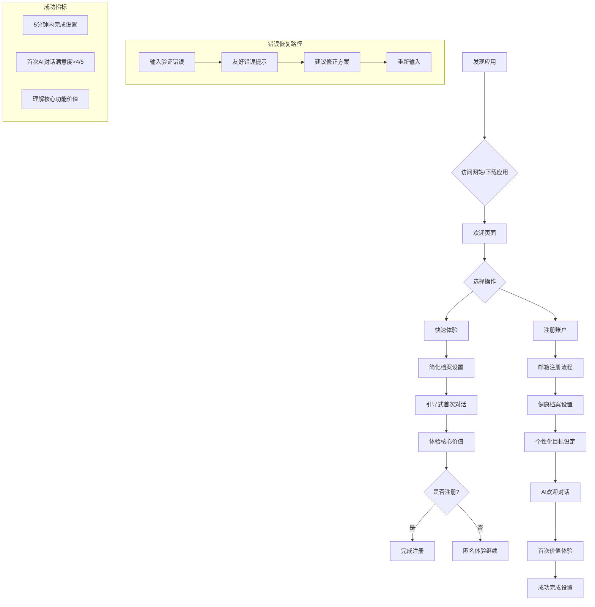
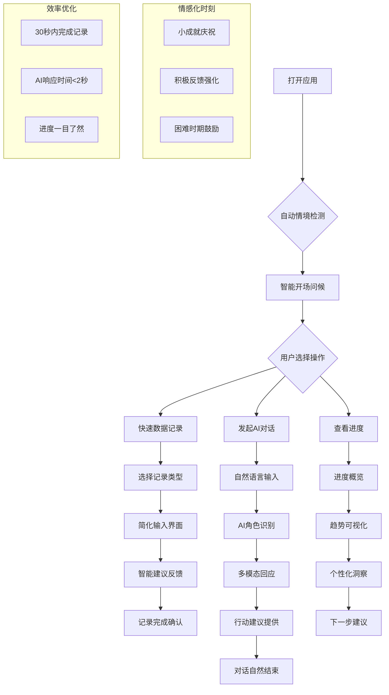
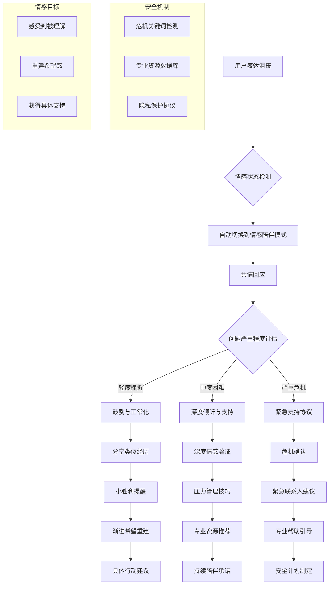
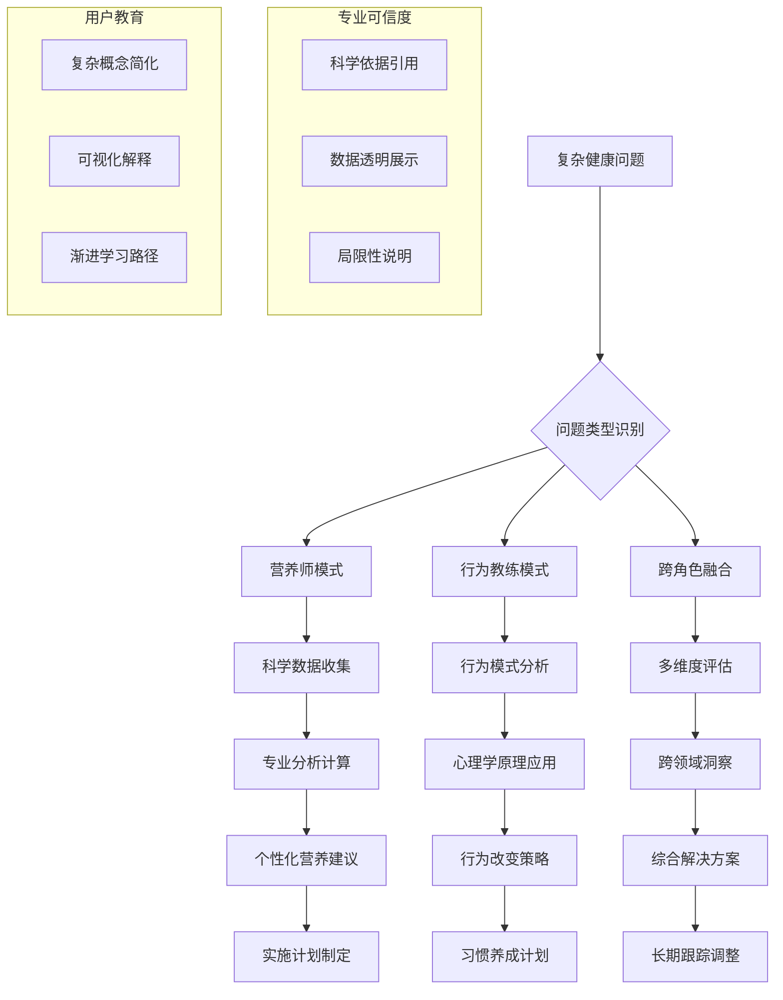

# UX Design Specification bmad

**Author:** Felix
**Date:** 2026-02-21

---

## Executive Summary

### Project Vision

打造一个低成本、高专业度、强情感陪伴的AI体重管理助手，通过融合营养师与行为教练的双重专业能力，为肥胖人群提供科学、可持续的减重方案，帮助他们建立长期健康生活习惯。以"一杯咖啡的价格，获得专业营养师+行为教练7×24小时的个性化陪伴"为核心价值主张。

### Target Users

**主要用户：张明（32岁IT工程师）**
- 体重95kg，BMI 32（肥胖），有轻度脂肪肝、高血压前期
- 痛点：真人营养师咨询费太贵（300-500元/次），自己研究营养知识太复杂，一个人减肥太孤独容易放弃
- 技术能力：熟练，期望高效、专业的数字工具
- 使用场景：工作间隙、早晚固定时间、需要即时专业建议时

**次要用户：李阿姨（52岁退休教师）**
- 更年期后体重增加，BMI 30
- 痛点：传统减肥方法不适合年龄特点，需要更多解释和耐心指导
- 技术能力：基础微信操作，App学习成本敏感
- 特殊需求：界面简单、字体大、说话方式温和耐心、需要更多"为什么"的解释

### Key Design Challenges

1. **多角色AI对话界面设计**
   - 清晰区分营养师、行为教练、情感陪伴三种专业角色
   - 实现平滑的动态角色切换和融合
   - 保持对话连贯性和上下文理解的一致性

2. **复杂健康数据管理**
   - 体重、饮食、运动、睡眠等多维度数据输入简化
   - 兼顾精确数据记录和快速便捷输入
   - 为不同技术水平的用户提供差异化输入方式

3. **专业性与情感支持的平衡**
   - 科学健康建议与温暖情感陪伴的融合
   - 游戏化激励元素与严肃健康内容的协调
   - 避免过度娱乐化影响专业可信度

4. **多设备与多用户适配**
   - 响应式设计支持手机、平板、桌面全设备
   - 为技术敏感用户提供简化界面和操作引导
   - 为技术熟练用户提供高级功能和深度分析

### Design Opportunities

1. **个性化渐进式体验**
   - 基于用户类型和技术水平动态调整界面复杂度
   - 渐进式功能解锁和复杂度增加
   - 个性化AI交互和情感回应

2. **健康数据故事化**
   - 将枯燥数字转化为有意义的健康进步故事
   - 可视化展示趋势、关联和成就
   - 基于数据的个性化鼓励和建议

3. **情感化设计语言**
   - 温暖、支持性的视觉和交互设计
   - 积极的反馈机制和成就庆祝
   - 危机时刻的紧急支持和专业引导

4. **跨领域融合创新**
   - 营养科学、行为心理学、情感支持的跨界融合
   - 专业健康工具与日常陪伴应用的结合
   - 科学量化与人性化关怀的平衡

## Core User Experience

### Defining Experience

**核心用户操作：AI对话驱动的健康管理**
用户最频繁且最关键的操作是与AI助手进行自然对话，获取个性化营养建议、行为指导和情感支持。成功的关键在于使AI交互感觉像与理解用户独特需求的真人专家对话，同时使健康数据记录变得简单直观。

**核心体验循环：**
1. **记录**：快速输入健康数据（体重、饮食、运动）
2. **对话**：与AI助手讨论进展、挑战和问题
3. **查看**：查看个性化建议和进度可视化
4. **调整**：基于反馈调整行为和目标
5. **庆祝**：获得认可、鼓励和成就感

### Platform Strategy

**多平台响应式设计：**
- 主要平台：Docker化Web应用，支持现代浏览器（Chrome, Safari, Firefox, Edge）
- 设计方法：移动优先的响应式设计，兼顾手机、平板、桌面体验
- 交互模式：同时优化触摸和鼠标/键盘交互

**技术约束与能力：**
- 部署：Docker容器化，确保环境一致性
- 性能：快速加载和响应，即使在移动网络条件下
- 推送通知：所有设备支持智能提醒和鼓励消息
- 设备能力利用：移动端摄像头（未来食物识别）、桌面端高级数据分析

### Effortless Interactions

**完全自然的用户操作：**
1. **一键记录**：体重、习惯打卡等高频操作的极简输入
2. **智能对话**：自然语言AI交互，无需学习复杂命令
3. **自动计算**：热量、营养、进度等数据的自动处理
4. **个性化默认**：基于用户资料的智能预设和推荐

**消除的摩擦点：**
- 简化注册：最少必要信息，快速开始体验
- 直观导航：清晰的信息架构，减少学习成本
- 智能帮助：上下文相关的指导和提示
- 错误预防：设计防止常见错误的交互模式

### Critical Success Moments

**决定性体验时刻：**
1. **首次价值认知**：用户第一次获得准确、个性化的AI建议
2. **数据洞察时刻**：看到自动生成的健康趋势和关联分析
3. **情感连接点**：感受到AI的真诚理解和情感支持
4. **成就庆祝时刻**：达到里程碑并获得认可和奖励

**成败攸关的流程：**
- **首次使用流程**：5分钟内完成设置并体验核心价值
- **每日记录流程**：30秒内完成当日主要健康数据记录
- **AI对话质量**：每次对话都提供相关、有用的建议
- **进度可视化**：清晰展示进步，即使变化微小

### Experience Principles

**指导UX决策的原则：**

1. **个性化优先原则**
   - 每个交互都应感觉是为用户量身定制
   - 基于用户类型、技术水平、偏好动态调整体验
   - AI回应和界面呈现高度个性化

2. **Effortless数据原则**
   - 健康数据管理应该简单直观，无需复杂计算
   - 最大化自动化，最小化手动输入
   - 为不同用户提供差异化数据输入方式

3. **情感连接原则**
   - 跨越所有设备和交互的情感支持和陪伴
   - 设计语言温暖、支持性，避免冷漠技术感
   - 在关键时刻提供真诚的鼓励和帮助

4. **渐进成就感原则**
   - 通过持续的小胜利驱动长期参与
   - 清晰展示进步，庆祝每个里程碑
   - 平衡严肃健康目标与愉悦用户体验

## Desired Emotional Response

### Primary Emotional Goals

1. **被理解和支持的感觉**：用户应该感受到AI真正理解他们的独特挑战和需求，提供个性化的专业指导
2. **希望和乐观感**：即使在减重困难时期，用户应该感受到进步的可能性和未来的希望
3. **掌控感和自主性**：用户应该感受到对自己健康旅程的控制，而不是被严格规则束缚
4. **陪伴感和不孤独**：用户应该感受到有专业伙伴陪伴他们度过减重旅程，减少孤独感

### Emotional Journey Mapping

**发现阶段：**
- 好奇和期待：对AI健康助手的可能性感到好奇
- 谨慎乐观：对低成本专业帮助的可能性感到乐观但保持谨慎

**首次使用：**
- 惊喜和认可：第一次获得准确个性化建议时的惊喜
- 信任建立：感受到AI的专业性和理解能力

**日常使用：**
- 轻松和便捷：数据记录和AI对话的流畅体验
- 持续鼓励：感受到持续的积极反馈和支持

**里程碑时刻：**
- 成就感和自豪感：达到减重目标时的成就感
- 情感连接：感受到AI的真诚庆祝和认可

**困难时期：**
- 被理解而非被评判：在挫折时感受到理解和支持
- 希望重建：获得重新开始的信心和具体指导

### Micro-Emotions

**关键积极微情感：**
- 信心：相信AI建议的科学性和个性化
- 信任：信任AI的专业判断和情感支持
- 轻松：健康数据管理的简单直观体验
- 温暖：感受到AI交互的情感温度

**要避免的负面微情感：**
- 挫败感：复杂的数据输入或难以理解的建议
- 孤独感：感觉自己在独自面对减重挑战
- 压力感：被严格的规则和限制所压迫
- 怀疑感：对AI建议的科学性或有效性产生怀疑

### Design Implications

1. **被理解感** → 高度个性化的AI回应、基于用户历史的上下文理解、情感智能的回应设计
2. **希望感** → 积极的视觉语言、进步可视化、小胜利的庆祝设计
3. **掌控感** → 灵活的目标设置、自主选择权、透明的算法解释
4. **陪伴感** → 持续的互动设计、情感化反馈、危机时刻的主动支持

### Emotional Design Principles

1. **真诚理解原则**：所有交互都应传达真诚的理解和共情，而非机械回应
2. **渐进希望原则**：通过持续的小进步和积极反馈建立长期希望
3. **自主尊重原则**：尊重用户的选择和节奏，提供指导而非强制
4. **温暖陪伴原则**：跨越所有交互的情感温度和支持性设计语言
5. **信任建立原则**：通过透明、一致、专业的交互建立用户信任

## UX Pattern Analysis & Inspiration

### Inspiring Products Analysis

**1. 微信（WeChat）**
- **核心优势**：无缝的社交整合、极简的界面设计、强大的小程序生态系统
- **UX成功因素**：
  - 统一的聊天界面处理多种交互（文字、语音、支付、小程序）
  - 渐进式功能发现，避免新手信息过载
  - 高度本地化的交互模式，符合中国用户习惯
- **可借鉴点**：聊天驱动的交互模式、渐进式功能展示、社交整合

**2. Keep（健身应用）**
- **核心优势**：游戏化的健身体验、社区支持、个性化计划
- **UX成功因素**：
  - 简洁的打卡和进度追踪界面
  - 视频指导与AI动作识别结合
  - 社区挑战和成就系统
- **可借鉴点**：健康数据可视化、游戏化激励、社区支持设计

**3. Headspace（冥想应用）**
- **核心优势**：情感化的设计语言、渐进式学习路径、个性化推荐
- **UX成功因素**：
  - 温暖、平静的视觉设计支持情感目标
  - 简短的每日练习，降低参与门槛
  - 个性化进度追踪和鼓励
- **可借鉴点**：情感化设计语言、渐进式学习、个性化反馈

**4. MyFitnessPal（营养追踪）**
- **核心优势**：庞大的食物数据库、快速记录界面、数据分析
- **UX成功因素**：
  - 条形码扫描和快速搜索简化数据输入
  - 清晰的营养数据可视化
  - 与健康设备的数据同步
- **可借鉴点**：简化数据输入、智能食物识别、多源数据整合

### Transferable UX Patterns

**导航模式：**
1. **聊天主导导航**（来自微信）- 适用于AI对话驱动的健康管理，将主要交互集中在聊天界面
2. **渐进式仪表板**（来自Keep）- 为不同用户提供不同复杂度的数据视图
3. **情感化引导流程**（来自Headspace）- 通过温暖的设计语言引导用户完成健康旅程

**交互模式：**
1. **快速记录模式**（来自MyFitnessPal）- 简化健康数据输入，支持多种输入方式
2. **游戏化打卡**（来自Keep）- 通过成就系统和挑战增加参与度
3. **个性化反馈循环**（来自Headspace）- 基于用户进展提供定制化鼓励和建议

**视觉模式：**
1. **温暖中性色调**（来自Headspace）- 支持情感陪伴和信任建立
2. **清晰数据可视化**（来自MyFitnessPal）- 使复杂健康数据易于理解
3. **响应式卡片设计**（来自微信小程序）- 适应不同设备和用户技能水平

### Anti-Patterns to Avoid

1. **信息过载仪表板** - 避免在首页展示过多复杂数据，特别是对技术敏感用户
2. **强制社交分享** - 健康数据敏感，避免强制或默认的社交分享
3. **复杂设置流程** - 避免冗长的初始设置，采用渐进式配置
4. **冷漠技术语言** - 避免使用过于技术性或医学化的术语
5. **刚性规则强制** - 避免过于严格的规则和惩罚机制，采用柔性指导

### Design Inspiration Strategy

**要采纳的：**
1. **微信的聊天驱动交互** - 因为AI对话是我们的核心体验，需要自然的对话界面
2. **Headspace的情感化设计** - 因为情感陪伴是我们的关键差异化因素
3. **Keep的游戏化进度追踪** - 因为渐进成就感是我们的核心设计原则

**要调整的：**
1. **MyFitnessPal的数据输入** - 简化并适应中国饮食习惯和本地食物数据库
2. **微信的小程序模式** - 调整为专业健康工具，保持简洁性和专注性
3. **Keep的社区功能** - 调整为更私密、安全的健康分享模式

**要避免的：**
1. **复杂健康应用的信息过载** - 与我们的"轻松数据"原则冲突
2. **强制社交整合** - 不符合健康数据的隐私敏感性
3. **冷漠技术界面** - 与我们的情感陪伴目标相悖

## Design System Foundation

### 1.1 Design System Choice

**选择：Tailwind CSS + Headless UI/Radix UI组合**

**核心组件：**
1. **Tailwind CSS**：作为样式基础，提供实用优先的CSS框架
2. **Headless UI**：提供完全无样式的可访问UI组件
3. **Radix UI**：提供原始组件，专注于可访问性和开发者体验

### Rationale for Selection

**技术一致性：**
- 项目已采用React + TypeScript + Tailwind CSS技术栈
- Tailwind CSS与现有架构无缝集成
- 避免引入不兼容的设计系统

**设计控制需求：**
- 需要创建独特的情感化设计语言
- 现有设计系统（如Material Design）过于技术化和冷漠
- 需要完全控制视觉风格以支持情感陪伴目标

**性能考虑：**
- Tailwind CSS的实用优先方法产生最小的CSS包大小
- 按需样式，避免未使用的CSS
- 适合移动端和网络条件较差的用户

**团队效率：**
- Tailwind CSS的学习曲线相对平缓
- 与React组件模型良好集成
- 强大的社区支持和文档

**可访问性基础：**
- Headless UI和Radix UI都专注于可访问性
- 为技术敏感用户（如李阿姨）提供更好的体验
- 符合健康应用的可访问性要求

### Implementation Approach

**分阶段实施：**

**阶段1：基础设置**
- 配置Tailwind CSS与项目现有设置
- 建立设计令牌（颜色、字体、间距等）
- 创建基础组件（按钮、输入框、卡片）

**阶段2：核心组件开发**
- 基于Headless UI构建可访问的对话界面组件
- 开发健康数据输入组件
- 创建进度可视化组件

**阶段3：高级组件**
- 开发AI角色切换界面
- 构建情感化反馈组件
- 创建游戏化成就系统

**阶段4：主题系统**
- 建立完整的设计主题系统
- 支持明暗模式（未来需求）
- 创建组件变体系统

### Customization Strategy

**设计令牌定制：**
1. **颜色系统**：温暖中性色调为主，支持情感目标
   - 主色调：温暖蓝色（信任、专业）
   - 辅助色：柔和绿色（健康、希望）
   - 强调色：温暖橙色（鼓励、能量）

2. **字体系统**：清晰易读，支持不同年龄用户
   - 主要字体：系统字体栈，确保跨平台一致性
   - 字号：针对中老年用户优化可读性

3. **间距和圆角**：柔和圆角，创造友好感
   - 基础间距：8px网格系统
   - 圆角：中等圆角，避免尖锐边缘

**组件定制原则：**
1. **情感化设计**：所有组件都应传达温暖和支持感
2. **渐进复杂度**：为不同用户提供不同复杂度的组件变体
3. **可访问性优先**：所有组件都应符合WCAG 2.1 AA标准
4. **响应式设计**：组件应适应手机、平板、桌面所有设备

**品牌整合：**
1. **视觉语言**：温暖、专业、支持性的设计语言
2. **交互模式**：流畅、自然的交互，减少认知负荷
3. **反馈设计**：积极、鼓励的反馈机制

## 2. Core User Experience

### 2.1 Defining Experience

**核心定义性体验：与理解你的AI健康伙伴进行自然对话**

体重管理AI助手的定义性体验是与一个真正理解用户独特健康挑战、情感状态和个人目标的AI助手进行自然、有意义的对话。这不是简单的问答，而是与一个融合了营养师专业知识、行为教练指导和情感陪伴支持的智能伙伴的持续对话。

**核心描述：** "就像有一个真正理解你的营养师+行为教练+朋友，随时准备帮助你，用温暖和专业的方式指导你的健康旅程。"

### 2.2 User Mental Model

**当前解决方案分析：**

1. **传统营养师咨询**：
   - 用户喜欢：个性化建议、专业可信度
   - 用户讨厌：高昂费用（300-500元/次）、预约不便、缺乏持续支持

2. **健康应用追踪**：
   - 用户喜欢：数据可视化、便捷记录
   - 用户讨厌：复杂输入、冷漠界面、缺乏个性化解释

3. **自我研究**：
   - 用户喜欢：免费、自主控制
   - 用户讨厌：信息过载、矛盾建议、缺乏针对性

**用户期望心智模型：**
- 期望1：专业健康建议应该个性化且易于理解
- 期望2：健康支持应该是持续可用的，而非一次性咨询
- 期望3：情感支持与专业指导同等重要
- 期望4：数据记录应该简单直观，而非繁琐任务

**潜在困惑点：**
1. AI角色的切换和融合（营养师 vs 行为教练 vs 情感陪伴）
2. 健康数据的隐私和安全边界
3. AI建议的科学性和可信度验证
4. 复杂健康概念的简化解释

### 2.3 Success Criteria

**核心对话体验成功指标：**

1. **响应相关性**：AI回应与用户当前情境和历史的匹配度 >90%
2. **情感共鸣**：用户感受到被理解和情感支持的强度评分 >4/5
3. **建议实用性**：用户能够立即应用AI建议的比例 >80%
4. **对话流畅性**：自然对话中断或需要澄清的次数 <1次/对话
5. **学习效果**：用户对健康概念的理解提升可测量

**用户体验成功时刻：**
1. **"啊哈"时刻**：用户第一次获得准确洞察时的惊喜感
2. **信任建立时刻**：用户开始依赖AI建议进行健康决策
3. **情感连接时刻**：用户在困难时期感受到AI的真诚支持
4. **进步认可时刻**：用户看到自己的健康改善被AI认可和庆祝

**性能标准：**
1. **响应时间**：AI回应延迟 <2秒
2. **对话连续性**：上下文记忆跨度 >30天
3. **个性化深度**：基于 >50个数据点的个性化建议

### 2.4 Novel UX Patterns

**创新模式组合：**

1. **多角色融合对话界面**：
   - 新颖性：单个对话界面中动态融合营养师、行为教练、情感陪伴三种专业角色
   - 用户教育：通过视觉标识和自然语言提示帮助用户理解当前活跃角色
   - 熟悉隐喻：借鉴微信的聊天界面，但增加专业角色维度

2. **情感智能反馈系统**：
   - 新颖性：基于用户情感状态动态调整回应语气和内容深度
   - 用户教育：透明展示AI的情感理解能力，建立信任
   - 熟悉隐喻：类似Headspace的情感化引导，但更个性化和动态

3. **渐进式数据输入**：
   - 新颖性：基于用户技能水平和情境的智能数据输入简化
   - 用户教育：逐步引入更高级的数据输入选项
   - 熟悉隐喻：类似MyFitnessPal的快速输入，但更智能和情境感知

**成熟模式应用：**
1. **聊天主导导航**（来自微信）：主要交互集中在对话界面
2. **卡片式信息展示**（来自Material Design）：复杂信息的模块化展示
3. **渐进式披露**（成熟模式）：逐步展示复杂功能，避免信息过载

### 2.5 Experience Mechanics

**核心对话体验流程：**

**1. 启动：**
- **触发方式**：用户打开应用自动进入对话界面，或通过"我需要帮助"按钮
- **情境感知**：AI基于时间、用户历史、最近活动提供情境化开场
- **邀请设计**：温暖问候 + 情境相关问题（如"今天感觉怎么样？"或"想聊聊昨天的饮食吗？"）

**2. 交互：**
- **用户输入**：自然语言文本输入、语音输入（未来）、快速选择按钮
- **AI角色指示**：视觉标识显示当前活跃角色（营养师🍎、行为教练🏃、情感陪伴❤️）
- **多模态响应**：文本回应 + 相关数据可视化 + 行动建议按钮
- **上下文记忆**：AI记住对话历史、用户偏好、健康目标

**3. 反馈：**
- **即时反馈**：输入时的打字指示、AI思考中的加载动画
- **成功反馈**：理解确认（"我明白了..."）、积极认可（"做得好！"）、情感共鸣（"这确实很有挑战..."）
- **错误处理**：友好澄清请求、提供选项、保持积极语气
- **进度反馈**：对话中的小成就庆祝、进度提醒、鼓励信息

**4. 完成：**
- **自然结束**：用户表示完成或AI检测到对话自然结束点
- **成果总结**：AI提供对话要点总结和行动建议
- **下一步引导**：基于对话内容建议后续步骤或下次对话时间
- **情感收尾**：温暖告别和鼓励话语

**特殊机制：**
1. **危机检测与响应**：当检测到用户沮丧或困难时，自动切换到情感陪伴模式
2. **里程碑庆祝**：达到健康目标时的特别庆祝对话和视觉反馈
3. **学习时刻**：复杂健康概念的简化解释和可视化教育
4. **数据洞察分享**：基于用户数据的个性化洞察和趋势分析

## Visual Design Foundation

### Color System

**核心情感颜色映射：**

1. **信任与专业（被理解感）**：温暖蓝色调
   - 传达专业可信度和情感理解
   - 避免冷漠的技术蓝色，选择带有温暖感的蓝色

2. **健康与希望（希望感）**：柔和绿色调
   - 象征健康、成长和积极变化
   - 选择柔和、不刺眼的绿色，避免医疗感

3. **能量与鼓励（掌控感）**：温暖橙色调
   - 提供能量感和积极鼓励
   - 选择温暖、友好的橙色，避免过于鲜艳

4. **温暖与陪伴（陪伴感）**：中性暖色调
   - 创造温暖、舒适的环境感
   - 使用米色、浅灰色等中性但温暖的色调

**具体颜色方案：**

**主要调色板：**
- **主要蓝色**：`#4A90E2`（温暖信任蓝）- 用于主要操作、导航、重要元素
- **辅助绿色**：`#7ED321`（柔和希望绿）- 用于成功状态、积极反馈、健康指标
- **强调橙色**：`#FF9500`（温暖鼓励橙）- 用于提醒、鼓励信息、成就庆祝
- **中性背景**：`#F8F9FA`（浅灰白）- 主要背景色，创造干净、舒适的空间感

**语义颜色：**
- **成功**：`#34C759`（健康绿色）- 积极健康指标、完成状态
- **警告**：`#FF9500`（温暖橙色）- 温和提醒、需要注意的事项
- **错误**：`#FF3B30`（柔和红色）- 错误状态，但避免过于严厉
- **信息**：`#5AC8FA`（友好蓝色）- 信息提示、帮助内容

**可访问性考虑：**
- 所有文本与背景对比度符合WCAG 2.1 AA标准（≥4.5:1）
- 主要操作按钮对比度符合AAA标准（≥7:1）
- 为色盲用户提供足够的亮度对比和图案区分

### Typography System

**整体色调：** 专业但友好，现代但温暖

**字体选择策略：**

**主要字体：系统字体栈（确保跨平台一致性）**
```
font-family: -apple-system, BlinkMacSystemFont, 'Segoe UI', 'PingFang SC', 'Hiragino Sans GB', 'Microsoft YaHei', 'Helvetica Neue', Helvetica, Arial, sans-serif;
```

**理由：**
1. **跨平台一致性**：在不同设备和操作系统上提供一致体验
2. **性能优化**：使用系统字体，无需加载外部字体文件
3. **可读性**：系统字体针对屏幕阅读优化
4. **本地化支持**：包含中文字体栈，确保中文良好显示

**类型比例（基于8px网格）：**
- **H1：32px/40px** - 页面标题、重要里程碑
- **H2：24px/32px** - 部分标题、对话角色标识
- **H3：20px/28px** - 子标题、数据卡片标题
- **Body Large：18px/28px** - 主要正文、对话内容
- **Body：16px/24px** - 常规正文、界面文本
- **Body Small：14px/20px** - 辅助文本、标签、时间戳
- **Caption：12px/16px** - 极小文本、元数据

**可访问性考虑：**
- 最小正文字体大小：16px（针对中老年用户优化）
- 行高：1.5倍字体大小，确保良好可读性
- 字体权重：常规400，中等500，粗体700
- 支持动态字体大小调整（用户系统设置）

### Spacing & Layout Foundation

**整体布局感觉：** 宽敞透气，创造轻松无压力的体验

**间距单位：8px网格系统**
- 基础单位：8px
- 倍数：8px、16px、24px、32px、40px、48px、64px
- 理由：8px网格提供足够的灵活性，同时保持视觉一致性

**空白策略：**
- **组件内间距**：16px（2×基础单位）
- **组件间间距**：24px（3×基础单位）
- **区块间间距**：32px-48px（4-6×基础单位）
- **页面边距**：移动端16px，平板24px，桌面32px

**网格系统：响应式12列网格**
- **移动端（<768px）**：4列，16px间距
- **平板（768px-1024px）**：8列，24px间距
- **桌面（>1024px）**：12列，32px间距

**布局原则：**
1. **对话中心原则**：对话界面占据主要视觉焦点
2. **渐进信息原则**：从简单到复杂的信息展示
3. **呼吸空间原则**：足够的空白减少认知负荷
4. **视觉层次原则**：清晰的信息重要性区分

**组件间距关系：**
- **紧凑组件**：按钮、输入框、标签 - 8-16px间距
- **标准组件**：卡片、列表项、对话气泡 - 16-24px间距
- **宽松组件**：内容区块、页面部分 - 24-48px间距

### Accessibility Considerations

**颜色可访问性：**
1. **对比度合规**：所有文本与背景对比度 ≥4.5:1
2. **色盲友好**：不使用仅靠颜色区分的状态指示
3. **焦点状态**：所有交互元素都有清晰可见的焦点指示
4. **减少运动**：为对运动敏感的用户提供减少动画选项

**文本可访问性：**
1. **字体大小调整**：支持用户系统字体大小设置
2. **行高和间距**：足够的行间距和段落间距
3. **文本缩放**：支持200%缩放而不破坏布局
4. **语言支持**：正确的中文排版和标点处理

**交互可访问性：**
1. **键盘导航**：所有功能可通过键盘访问
2. **屏幕阅读器**：适当的ARIA标签和语义HTML
3. **触摸目标**：最小44×44px触摸目标大小
4. **错误处理**：清晰的可访问错误消息和恢复

**认知可访问性：**
1. **简化语言**：避免复杂医学术语，使用通俗解释
2. **一致模式**：整个应用使用一致的交互模式
3. **渐进披露**：复杂功能逐步引入，避免信息过载
4. **错误预防**：设计防止常见错误的交互

## Design Direction Decision

### Design Directions Explored

**探索的6个方向：**

1. **方向1: 对话中心简约** - 极简主义，对话优先，移动优化
2. **方向2: 数据驱动仪表板** - 数据可视化，洞察优先，桌面优化  
3. **方向3: 情感陪伴温暖** - 情感化设计，温暖色调，渐进引导
4. **方向4: 专业健康工具** - 专业感，高效工作流，深度分析
5. **方向5: 游戏化体验** - 游戏化，成就系统，社交元素
6. **方向6: 混合自适应** - 自适应界面，角色切换，智能推荐

**评估标准：**
- 布局直观性：哪个信息层次结构最符合优先级？
- 交互风格：哪种交互风格最适合核心体验？
- 视觉权重：哪种视觉密度感觉适合品牌？
- 导航方法：哪种导航模式符合用户期望？
- 组件使用：组件如何支持用户旅程？
- 品牌一致性：哪个方向最能支持情感目标？

### Chosen Direction

**方向1: 对话中心简约**（主要选择）

**核心设计原则：**
1. **对话优先**：对话界面占据90%屏幕空间，作为主要交互渠道
2. **极简导航**：底部导航栏，仅包含核心功能（对话、数据、进度、设置）
3. **移动优化**：针对手机体验设计，兼顾平板和桌面响应式适配
4. **渐进披露**：复杂功能逐步引入，避免新手信息过载

**关键界面特征：**
- 主要布局：全屏对话界面，底部输入区域
- 次要功能：通过底部导航或手势访问数据、进度视图
- 视觉层次：对话内容 > 进度反馈 > 导航控制
- 交互模式：自然语言输入为主，快速选择按钮为辅

### Design Rationale

**用户中心理由：**
1. **降低学习成本**：技术敏感用户（李阿姨）能快速上手
2. **专注核心价值**：用户最需要的是AI对话，而非复杂功能
3. **情感支持**：简约设计减少压力，支持轻松健康管理体验
4. **渐进参与**：用户可以从简单对话开始，逐步探索高级功能

**业务目标对齐：**
1. **MVP可行性**：相对简单的设计，适合快速开发和测试
2. **可扩展性**：可以从简约基础逐步添加数据可视化、游戏化等元素
3. **品牌一致性**：简约专业的设计传达可信度和现代感
4. **差异化优势**：在复杂健康应用中提供清新简单的替代方案

**技术实施优势：**
1. **开发效率**：相对简单的UI组件和布局
2. **性能优化**：最小化界面复杂度，提升加载和响应速度
3. **维护简便**：清晰的组件结构和设计模式
4. **测试覆盖**：核心功能集中，易于测试和迭代

### Implementation Approach

**阶段1：核心对话界面（MVP）**
- 实现全屏对话界面，支持文本输入和AI回应
- 底部导航栏：对话、数据（简化）、设置
- 基本进度反馈：简洁进度条和成就徽章
- 情感化设计元素：温暖色调、友好图标、积极反馈

**阶段2：增强数据可视化**
- 从方向2引入简洁数据卡片
- 健康趋势可视化（简化版）
- 个性化洞察展示
- 快速数据输入改进

**阶段3：情感化增强**
- 从方向3引入情感陪伴模式
- AI角色视觉标识（营养师🍎、教练🏃、陪伴❤️）
- 危机检测和情感支持功能
- 个性化鼓励和庆祝时刻

**阶段4：轻量游戏化**
- 从方向5引入渐进式成就系统
- 简单挑战和里程碑庆祝
- 社交分享选项（可选）
- 进度可视化增强

**设计系统整合：**
- 使用Tailwind CSS实现响应式布局
- 基于8px网格系统的间距和组件设计
- 应用建立的视觉基础（颜色、字体、可访问性）
- 创建可复用的对话界面组件库

## User Journey Flows

### 首次使用和设置旅程

**旅程目标**：新用户完成注册、创建健康档案、体验首次AI对话价值

**Mermaid流程图：**


**流程描述：**
1. **入口点**：用户通过网站或应用商店发现应用
2. **快速体验选项**：为犹豫用户提供无需注册的试用
3. **渐进档案设置**：分步骤收集必要健康信息，避免信息过载
4. **个性化目标设定**：基于用户数据设定现实可行的健康目标
5. **AI欢迎对话**：情境化的首次对话，展示AI的理解能力和专业价值
6. **成功确认**：明确展示设置完成和下一步行动建议

**优化点：**
- 最小化注册步骤：仅收集必要信息
- 渐进式披露：复杂功能后续引入
- 即时价值展示：5分钟内体验核心功能
- 错误友好处理：清晰指导修正错误

### 日常健康管理旅程

**旅程目标**：用户完成日常健康数据记录、获取个性化建议、追踪进度

**Mermaid流程图：**


**流程描述：**
1. **智能情境检测**：基于时间、用户历史提供情境化开场
2. **多操作路径**：支持快速记录、深度对话、进度查看不同需求
3. **简化数据输入**：为常见操作提供极简输入界面
4. **AI对话流程**：自然语言交互，智能角色切换，多模态回应
5. **进度可视化**：清晰展示趋势、成就和个性化洞察
6. **情感化设计**：融入庆祝、鼓励等情感时刻

**优化点：**
- 30秒完成日常记录：极简输入设计
- 个性化开场：基于用户习惯和时间的智能问候
- 渐进复杂度：为不同用户提供不同复杂度的界面
- 情感连接：每个交互都包含情感元素

### 情感支持旅程

**旅程目标**：用户在困难时期获得情感陪伴、危机支持和希望重建

**Mermaid流程图：**


**流程描述：**
1. **情感状态检测**：通过语言分析识别用户情感状态
2. **自动模式切换**：从其他模式无缝切换到情感陪伴模式
3. **分层响应策略**：基于问题严重程度提供不同级别的支持
4. **共情与验证**：首先确认和验证用户情感体验
5. **希望重建**：通过小胜利提醒和渐进目标重建希望
6. **具体行动**：提供可操作的支持建议和资源

**优化点：**
- 即时情感响应：检测到负面情绪时立即切换模式
- 分层支持系统：从轻度鼓励到危机干预的连续支持
- 安全第一：危机情况的专业引导和资源推荐
- 持续陪伴：明确表达AI的持续可用性

### 专业指导旅程

**旅程目标**：用户获取深度营养和行为指导，解决复杂健康问题

**Mermaid流程图：**


**流程描述：**
1. **问题类型识别**：分析用户问题，确定最合适的专业角色
2. **专业模式激活**：营养师、行为教练或融合模式
3. **科学数据收集**：收集必要信息进行专业分析
4. **深度分析计算**：应用科学公式和心理学原理
5. **个性化建议生成**：基于用户独特情况的定制建议
6. **实施计划制定**：可操作、可追踪的实施步骤
7. **用户教育**：解释背后的科学原理，提升健康素养

**优化点：**
- 专业可信度：明确引用科学依据和数据来源
- 个性化深度：基于用户完整档案的深度分析
- 实施可行性：确保建议现实可行、可追踪
- 持续优化：基于反馈和结果调整建议

### Journey Patterns

**导航模式：**
1. **对话主导导航**：主要交互通过对话界面，减少传统导航需求
2. **渐进式侧边栏**：次要功能通过可展开侧边栏访问，保持界面简洁
3. **情境化快捷方式**：基于用户当前情境提供相关快捷操作

**决策模式：**
1. **简化二元选择**：复杂决策简化为清晰的二元选择
2. **渐进信息披露**：决策时只提供必要信息，详细信息可展开
3. **默认智能推荐**：基于用户历史提供智能默认选择

**反馈模式：**
1. **即时操作反馈**：每个操作都有即时视觉或文字反馈
2. **渐进成就反馈**：小进步也有庆祝，大成就特别强调
3. **情感化错误反馈**：错误提示包含鼓励和改进指导

### Flow Optimization Principles

**效率原则：**
1. **30秒规则**：常见操作应在30秒内完成
2. **三次点击规则**：核心功能应在三次点击内访问
3. **零学习曲线**：基础功能应无需学习即可使用

**愉悦原则：**
1. **惊喜时刻**：在预期之外提供小惊喜和愉悦
2. **个性化认可**：每个用户都应感受到独特的认可
3. **情感温度**：所有交互都应包含情感元素

**弹性原则：**
1. **多路径达成**：重要目标应有多种实现路径
2. **错误恢复友好**：错误应有清晰、友好的恢复路径
3. **渐进复杂度**：从简单开始，逐步引入复杂功能

**一致性原则：**
1. **模式一致性**：相似任务使用相似交互模式
2. **视觉一致性**：整个应用保持一致的视觉语言
3. **情感一致性**：所有交互保持一致的情感温度

## Component Strategy

### Design System Components

**Tailwind CSS 基础样式：**
- 颜色系统：使用建立的调色板（主要蓝色、辅助绿色、强调橙色）
- 字体系统：系统字体栈，确保跨平台一致性
- 间距系统：8px网格，提供视觉一致性
- 响应式工具：移动优先的断点系统

**Headless UI 可访问组件：**
- 对话框（Dialog）：用于设置、详细说明等模态窗口
- 下拉菜单（Menu）：用于用户菜单、设置选项
- 切换开关（Switch）：用于设置开关、功能启用
- 标签页（Tabs）：用于数据视图切换、功能分区
- 列表框（Listbox）：用于选择列表、选项菜单

**Radix UI 原始组件：**
- 手风琴（Accordion）：用于FAQ、详细说明展开
- 警报对话框（AlertDialog）：用于重要确认、警告信息
- 复选框（Checkbox）：用于多选、设置选项
- 上下文菜单（ContextMenu）：用于右键菜单、快捷操作
- 悬停卡片（HoverCard）：用于提示信息、快速预览

**覆盖分析：**
- **良好覆盖**：基础交互组件（按钮、输入、对话框）
- **部分覆盖**：数据展示组件（需要自定义样式和情感化设计）
- **需要自定义**：专业健康组件、AI对话界面、情感化元素

### Custom Components

#### 对话气泡组件

**目的：** 显示AI和用户的对话内容，传达情感温度和专业角色
**使用：** 在对话界面中显示所有消息，区分用户和AI，标识不同AI角色
**解剖结构：**
- 头像区域：角色标识（营养师🍎、教练🏃、陪伴❤️）
- 内容区域：消息文本、时间戳、情感指示器
- 操作区域：复制按钮、展开详情、快速回复
- 状态指示器：发送状态、阅读状态、重要性标记

**状态：**
- 默认：正常显示的消息
- 发送中：用户消息发送中的动画状态
- 已发送：消息成功发送的确认状态
- 错误：发送失败的错误状态
- 高亮：重要消息的特殊强调状态

**变体：**
- 用户消息：右侧对齐，浅蓝色背景
- AI消息：左侧对齐，白色背景带阴影
- 营养师模式：绿色边框，营养图标
- 教练模式：蓝色边框，运动图标
- 陪伴模式：橙色边框，爱心图标

**可访问性：**
- ARIA角色="article"，aria-label描述消息内容和发送者
- 键盘导航：Tab键聚焦，Enter键触发主要操作
- 屏幕阅读器：清晰的角色和内容描述
- 颜色对比度：文本与背景对比度≥4.5:1

#### 健康进度卡片

**目的：** 简洁展示健康进度和关键指标，提供快速洞察
**使用：** 在仪表板、进度页面显示健康指标和趋势
**解剖结构：**
- 标题区域：指标名称、时间范围
- 数据区域：关键数字、进度条、趋势箭头
- 可视化区域：简化图表、成就徽章
- 操作区域：查看详情、快速记录、分享

**状态：**
- 正常：指标在健康范围内
- 接近目标：接近设定目标的积极状态
- 达到目标：成功达到目标的庆祝状态
- 需要关注：指标需要改进的提醒状态

**变体：**
- 简化版：移动端优化，最小信息展示
- 详细版：桌面端，包含趋势图表和详细数据
- 教育版：针对新用户，包含解释和指导

**可访问性：**
- ARIA标签描述指标含义和当前状态
- 进度条使用aria-valuenow、aria-valuemin、aria-valuemax
- 键盘操作：所有交互元素可通过键盘访问
- 语义HTML：使用适当的标题层次和列表结构

#### 情感化成就徽章

**目的：** 庆祝用户成就，提供游戏化激励和情感认可
**使用：** 在成就页面、进度庆祝、日常鼓励中显示
**解剖结构：**
- 徽章图标：视觉标识，传达成就类型
- 成就名称：简短描述性名称
- 解锁条件：如何获得此成就的说明
- 庆祝元素：动画效果、特殊视觉效果

**状态：**
- 锁定：尚未解锁的成就
- 新解锁：刚刚解锁的成就，有庆祝动画
- 已获得：已获得的成就，正常显示
- 特别成就：稀有或重要成就的特殊显示

**变体：**
- 日常成就：小胜利庆祝，简单设计
- 里程碑成就：重要目标达成，突出设计
- 挑战成就：完成特定挑战，特殊设计
- 社交成就：社交互动相关，共享设计

**可访问性：**
- ARIA标签描述成就含义和状态
- 动画可关闭选项，为对运动敏感的用户
- 键盘导航：可通过键盘浏览和选择成就
- 替代文本：所有图标都有描述性替代文本

#### 多角色切换控件

**目的：** 允许用户手动切换AI角色，或显示当前活跃角色
**使用：** 在对话界面、设置页面控制AI行为模式
**解剖结构：**
- 角色选项：营养师、行为教练、情感陪伴的可视化表示
- 当前选择：突出显示当前活跃角色
- 模式说明：每个角色的简要功能描述
- 自动模式选项：允许AI智能切换的选项

**状态：**
- 默认：显示当前活跃角色
- 选择中：用户正在选择角色
- 自动模式：AI智能切换模式激活
- 禁用：某些角色暂时不可用

**变体：**
- 简化版：三个图标切换，最小界面
- 详细版：包含角色描述和示例
- 情境版：基于当前情境推荐角色

**可访问性：**
- ARIA角色="radiogroup"，每个选项为radio
- 键盘导航：箭头键切换，Enter键确认
- 屏幕阅读器：清晰描述每个角色功能和当前选择
- 焦点管理：清晰的焦点指示和状态反馈

#### 简化数据输入器

**目的：** 极简健康数据记录，降低输入门槛
**使用：** 快速记录体重、饮食、运动等健康数据
**解剖结构：**
- 输入字段：最小必要输入，智能默认值
- 快速选择：常见选项的按钮选择
- 智能建议：基于历史的预测和建议
- 确认区域：完成按钮和取消选项

**状态：**
- 空状态：等待输入，显示引导提示
- 输入中：用户正在输入，显示验证反馈
- 有效：输入有效，显示确认选项
- 错误：输入无效，显示友好错误提示

**变体：**
- 数字输入：体重、步数等数字记录
- 选择输入：饮食类型、运动类型选择
- 文本输入：感受、备注等自由文本
- 语音输入：未来支持的语音记录

**可访问性：**
- ARIA标签清晰描述每个输入字段
- 键盘导航：Tab键顺序合理，Enter键提交
- 错误处理：清晰的错误消息和修正指导
- 输入帮助：上下文相关的输入提示和示例

### Component Implementation Strategy

**设计令牌集成：**
- 所有自定义组件使用建立的Tailwind CSS设计令牌
- 颜色：使用调色板中的语义颜色变量
- 字体：使用类型比例和字体栈
- 间距：使用8px网格系统
- 圆角：使用一致的圆角值

**可访问性优先：**
- 所有组件符合WCAG 2.1 AA标准
- 键盘导航完整支持
- 屏幕阅读器优化
- 颜色对比度合规
- 减少运动选项

**响应式设计：**
- 移动优先的组件设计
- 自适应布局和内容
- 触摸目标大小≥44px
- 桌面端增强功能

**情感化设计：**
- 所有组件包含情感元素
- 温暖友好的视觉语言
- 积极鼓励的反馈机制
- 成就庆祝的特殊效果

**性能优化：**
- 按需加载组件
- 代码分割和懒加载
- 最小化包大小
- 优化渲染性能

### Implementation Roadmap

**阶段1：核心对话界面（MVP - 第1-2周）**
- 对话气泡组件：支持基础AI对话
- 简化数据输入器：体重和饮食快速记录
- 底部导航组件：应用基础导航
- 基础布局组件：响应式容器和网格

**阶段2：增强用户体验（第3-4周）**
- 健康进度卡片：进度可视化和成就展示
- 多角色切换控件：AI角色手动切换
- 情感化成就徽章：游戏化激励系统
- 设置对话框组件：用户偏好设置

**阶段3：专业功能组件（第5-6周）**
- 高级数据可视化：趋势图表和分析工具
- 专业工具组件：营养计算器、行为分析
- 个性化仪表板：自适应界面组件
- 社交分享组件：成就分享和社区功能

**阶段4：优化和扩展（第7-8周及以后）**
- 性能优化组件：懒加载、代码分割
- 高级交互组件：手势支持、语音输入
- 主题系统组件：明暗模式支持
- 可扩展架构：插件系统和第三方集成

**优先级标准：**
1. **用户旅程关键性**：支持核心用户旅程的组件优先
2. **实施复杂度**：简单组件先实现，复杂组件后实现
3. **价值交付**：高用户价值组件优先开发
4. **技术依赖性**：基础组件先实现，依赖组件后实现

## UX Consistency Patterns

### Button Hierarchy

**何时使用：** 定义不同重要性级别的操作优先级

**视觉设计：**
- **主要按钮**：温暖蓝色（#4A90E2），圆角8px，高度44px，全宽或内边距左右24px
- **次要按钮**：白色背景，蓝色边框，圆角8px，高度44px
- **文本按钮**：蓝色文本，无背景，用于辅助操作
- **图标按钮**：圆形，直径44px，用于频繁操作
- **情感化按钮**：特殊场合使用，如庆祝时的橙色按钮

**行为：**
- **主要操作**：完成当前任务的关键操作（如"发送消息"、"保存记录"）
- **次要操作**：替代或辅助操作（如"取消"、"稍后提醒"）
- **危险操作**：红色强调，需要额外确认（如"删除账户"）
- **渐进式操作**：多步骤流程中的"下一步"按钮

**可访问性：**
- 所有按钮最小触摸目标44×44px
- 焦点状态：蓝色边框，2px宽度
- ARIA标签：描述性标签，而非通用"按钮"
- 键盘导航：Tab键顺序遵循视觉层次

**移动端考虑：**
- 底部固定操作栏用于关键操作
- 手势操作作为按钮替代
- 触摸目标考虑手指大小差异

**变体：**
- **紧凑变体**：高度36px，用于空间有限处
- **扩展变体**：高度52px，用于重要确认
- **情感变体**：庆祝时使用橙色，鼓励时使用绿色

### Feedback Patterns

**何时使用：** 向用户提供系统状态、成功确认、错误信息或情感支持

**视觉设计：**
- **成功反馈**：绿色背景，对勾图标，温和动画
- **错误反馈**：柔和红色背景，友好错误图标，具体修正建议
- **警告反馈**：橙色背景，提醒图标，温和语气
- **信息反馈**：蓝色背景，信息图标，简洁说明
- **情感反馈**：温暖色调，爱心或庆祝图标，个性化消息

**行为：**
- **即时反馈**：操作后立即显示，2-3秒后自动消失
- **持久反馈**：重要信息保持显示，直到用户操作
- **渐进反馈**：多步骤操作的分步反馈
- **情感反馈**：基于用户情感状态的个性化回应

**可访问性：**
- 屏幕阅读器即时播报反馈
- 颜色不唯一指示状态（结合图标和文本）
- 键盘可关闭的持久反馈
- 动画可关闭选项

**移动端考虑：**
- 底部Toast通知，不遮挡主要内容
- 手势可关闭的反馈卡片
- 振动反馈作为视觉补充（可选）

**变体：**
- **微反馈**：按钮状态变化、输入验证等小反馈
- **中反馈**：操作成功/失败的Toast通知
- **大反馈**：重要成就的全屏庆祝
- **情感反馈**：个性化鼓励和认可

### Form Patterns

**何时使用：** 收集用户输入，特别是健康数据和设置信息

**视觉设计：**
- **简化表单**：单输入字段，最大程度减少认知负荷
- **渐进表单**：复杂信息分步骤收集
- **智能表单**：基于历史提供智能默认值和预测
- **情感化表单**：温暖语言和鼓励性标签

**行为：**
- **即时验证**：输入时实时验证，友好错误提示
- **智能默认**：基于用户档案和历史提供默认值
- **渐进披露**：高级选项默认隐藏，需要时展开
- **上下文帮助**：复杂字段的即时解释和示例

**可访问性：**
- 清晰字段标签和说明
- 键盘完整导航支持
- 屏幕阅读器友好的错误消息
- 颜色不依赖的状态指示

**移动端考虑：**
- 移动优化输入类型（数字键盘、日期选择器）
- 避免复杂下拉菜单，使用选择器或按钮组
- 自动聚焦和适当键盘类型

**变体：**
- **快速记录表单**：极简输入，30秒内完成
- **详细设置表单**：完整选项，分步骤组织
- **教育表单**：包含解释和指导的输入
- **情感化表单**：鼓励性语言和积极反馈

### Navigation Patterns

**何时使用：** 在应用不同部分间移动，访问功能和信息

**视觉设计：**
- **底部导航**：3-4个核心功能图标，当前选中状态突出
- **对话主导导航**：通过AI对话访问功能，减少传统导航
- **情境侧边栏**：可展开侧边栏，提供上下文相关选项
- **手势导航**：滑动返回、长按快捷操作等

**行为：**
- **预测性导航**：基于用户习惯预测下一步操作
- **渐进式导航**：新功能逐步引入导航系统
- **情感化导航**：导航包含情感元素和鼓励
- **无障碍导航**：多种方式访问同一功能

**可访问性：**
- 清晰当前位置指示
- 键盘完整导航支持
- 屏幕阅读器友好的导航结构
- 跳过导航链接

**移动端考虑：**
- 拇指可达的导航位置
- 手势导航作为补充
- 移动端简化导航选项
- 响应式导航模式

**变体：**
- **简化导航**：技术敏感用户的极简选项
- **高级导航**：技术熟练用户的完整功能访问
- **情境导航**：基于当前任务的动态选项
- **情感导航**：包含成就和鼓励的导航

### Modal and Overlay Patterns

**何时使用：** 需要用户专注的临时界面，如设置、确认、详细说明

**视觉设计：**
- **中心模态**：屏幕中心，适度大小，背景模糊
- **底部表单**：从底部滑出，适合移动端输入
- **侧边面板**：从侧边滑入，用于辅助信息
- **全屏覆盖**：重要操作的全屏界面

**行为：**
- **清晰退出**：始终提供明确的关闭方式
- **焦点管理**：打开时自动聚焦第一个可交互元素
- **背景交互**：决定背景是否可交互（模态 vs 非模态）
- **层级管理**：多个覆盖层的正确堆叠顺序

**可访问性：**
- 屏幕阅读器焦点陷阱在模态内
- 键盘可关闭所有模态
- ESC键关闭支持
- ARIA模态角色和标签

**移动端考虑：**
- 移动端手势关闭支持
- 响应式模态大小和位置
- 移动端优化输入控件
- 避免移动端复杂模态

**变体：**
- **轻量模态**：简单确认或信息显示
- **表单模态**：数据输入或设置
- **教育模态**：功能说明或教程
- **庆祝模态**：成就庆祝的特殊设计

### Empty and Loading States

**何时使用：** 无数据时、内容加载中、首次使用等场景

**视觉设计：**
- **教育性空状态**：说明如何开始，提供具体行动建议
- **情感化空状态**：鼓励性插图和温暖信息
- **渐进式加载**：骨架屏幕，逐步显示内容
- **情感化加载**：鼓励性消息和温和动画

**行为：**
- **主动引导**：空状态提供明确的下一步行动
- **进度透明**：加载状态显示进度和预计时间
- **错误恢复**：加载失败时的友好恢复选项
- **缓存策略**：合理使用缓存减少空状态

**可访问性：**
- 屏幕阅读器播报加载状态和预计时间
- 加载动画可关闭选项
- 空状态的清晰行动指导
- 错误状态的恢复指导

**移动端考虑：**
- 移动端优化的骨架屏幕
- 离线状态的适当处理
- 网络状况检测和相应反馈
- 移动端数据使用考虑

**变体：**
- **首次使用空状态**：欢迎和引导
- **无数据空状态**：鼓励开始记录
- **搜索空状态**：无结果的建议和替代
- **错误空状态**：友好错误和恢复指导

### Search and Filter Patterns

**何时使用：** 在大量内容中查找特定信息，如对话历史、健康记录

**视觉设计：**
- **简化搜索**：单个搜索框，智能建议
- **渐进筛选**：基本筛选选项，高级选项可展开
- **视觉筛选**：图标或标签选择，直观易懂
- **情感化搜索**：温暖语言和鼓励性占位符

**行为：**
- **即时搜索**：输入时实时显示结果
- **智能建议**：基于历史和上下文提供搜索建议
- **渐进筛选**：从简单到复杂的筛选选项
- **搜索历史**：保存和智能推荐搜索历史

**可访问性：**
- 清晰搜索说明和示例
- 键盘完整导航支持
- 屏幕阅读器友好的结果反馈
- 筛选状态的清晰指示

**移动端考虑：**
- 移动端优化的搜索界面
- 手势清除搜索内容
- 语音搜索支持（未来）
- 移动端筛选的简化设计

**变体：**
- **快速搜索**：极简搜索，快速访问
- **高级搜索**：多条件筛选，复杂查询
- **情境搜索**：基于当前任务的智能搜索
- **教育搜索**：包含指导和示例的搜索

### Emotional Design Patterns

**何时使用：** 所有交互中融入情感元素，支持情感目标

**视觉设计：**
- **温暖色调**：使用建立的温暖颜色调色板
- **友好图标**：圆润、友好的图标设计
- **情感化微交互**：温和动画、庆祝效果
- **个性化元素**：基于用户偏好的定制设计

**行为：**
- **情感检测与响应**：识别用户情感状态并相应调整
- **个性化认可**：基于用户历史的独特认可和鼓励
- **渐进成就感**：小进步的庆祝和认可
- **危机支持**：困难时期的特别支持和引导

**可访问性：**
- 情感内容有文字描述
- 动画可关闭选项
- 情感状态的可访问指示
- 个性化内容的适当标记

**移动端考虑：**
- 移动端优化的情感化交互
- 触摸屏的情感化反馈
- 移动端性能考虑的情感化元素
- 移动端数据使用的情感化提示

**变体：**
- **日常情感化**：常规交互中的温暖元素
- **成就情感化**：里程碑的特别庆祝
- **危机情感化**：困难时期的深度支持
- **个性化情感化**：基于用户档案的定制情感设计

## Responsive Design & Accessibility

### Responsive Strategy

**移动优先设计哲学：**
体重管理AI助手采用移动优先设计方法，确保核心功能在最小屏幕上完美工作，然后逐步增强更大屏幕的体验。

**设备特定策略：**

**移动端（<768px）：**
- **对话中心界面**：全屏对话，底部输入区域，简化导航
- **极简数据输入**：快速记录界面，最小必要字段
- **拇指友好设计**：底部导航，大触摸目标，手势支持
- **性能优化**：最小化资源加载，离线功能支持

**平板（768px-1024px）：**
- **分屏布局**：左侧对话，右侧数据可视化或设置
- **增强输入**：更多输入选项，同时保持触摸友好
- **多任务支持**：支持同时查看对话和进度
- **手势增强**：更多手势操作，如滑动切换视图

**桌面端（>1024px）：**
- **多列布局**：对话、数据、进度三列布局
- **高级功能**：高级分析工具、详细设置、批量操作
- **键盘优化**：键盘快捷键、高效导航、批量编辑
- **丰富可视化**：详细图表、趋势分析、对比视图

**核心原则：**
1. **功能一致性**：所有设备提供相同核心功能
2. **体验优化**：每个设备获得最佳交互体验
3. **渐进增强**：从移动基础开始，逐步添加功能
4. **情感一致性**：所有设备保持相同情感温度

### Breakpoint Strategy

**标准断点系统：**
基于Tailwind CSS的响应式断点系统，确保与设计系统一致性。

**主要断点：**
- **sm：640px** - 小型移动设备优化
- **md：768px** - 平板设备开始
- **lg：1024px** - 桌面端开始
- **xl：1280px** - 大桌面端
- **2xl：1536px** - 超大屏幕

**自定义断点：**
- **对话优化断点：480px** - 对话界面的最佳阅读宽度
- **数据可视化断点：900px** - 数据图表的最佳显示宽度
- **多列布局断点：1100px** - 三列布局的起始点

**断点应用规则：**
1. **移动优先媒体查询**：从最小屏幕开始，使用min-width
2. **内容优先断点**：基于内容需要而非设备尺寸
3. **渐进式布局**：布局逐步变化，而非突然跳跃
4. **性能考虑**：避免过多断点导致代码复杂

**响应式模式：**
1. **流体网格**：使用百分比和flex/grid布局
2. **灵活图像**：响应式图片，srcset优化
3. **媒体查询模块**：组件级别的响应式样式
4. **移动优先CSS**：基础样式移动，增强样式桌面

### Accessibility Strategy

**合规性目标：WCAG 2.1 AA级**
体重管理AI助手以WCAG 2.1 AA级为标准，确保广泛的可访问性覆盖。

**关键可访问性要求：**

**视觉可访问性：**
1. **颜色对比度**：所有文本与背景对比度≥4.5:1，大文本≥3:1
2. **非颜色指示**：状态不单独依赖颜色，结合图标和文本
3. **文本可缩放**：支持200%文本缩放而不破坏布局
4. **减少运动**：为对运动敏感的用户提供减少动画选项

**交互可访问性：**
1. **键盘导航**：所有功能可通过键盘完整访问
2. **焦点管理**：清晰可见的焦点指示，逻辑Tab顺序
3. **触摸目标**：最小44×44px触摸目标，移动端优化
4. **手势替代**：所有手势操作有按钮替代

**认知可访问性：**
1. **简化语言**：避免复杂医学术语，使用通俗解释
2. **一致模式**：整个应用使用一致的交互模式
3. **错误预防**：设计防止常见错误的交互
4. **渐进披露**：复杂功能逐步引入，避免信息过载

**技术可访问性：**
1. **语义HTML**：正确使用HTML5语义元素
2. **ARIA属性**：适当使用ARIA标签、角色和属性
3. **屏幕阅读器**：优化VoiceOver、NVDA、JAWS支持
4. **替代文本**：所有非文本内容有描述性替代文本

**特殊考虑：**
1. **老年用户优化**：针对李阿姨等年长用户的特殊优化
2. **健康数据隐私**：健康信息的隐私和安全考虑
3. **情感状态支持**：情感化设计不影响可访问性
4. **多语言支持**：中文的适当排版和标点处理

### Testing Strategy

**综合测试方法：**
结合自动化测试、手动测试和用户测试，确保响应式设计和可访问性质量。

**响应式测试：**

**设备测试矩阵：**
- **移动端**：iPhone SE/13/15，Android各种尺寸
- **平板**：iPad，Android平板
- **桌面端**：各种屏幕尺寸和分辨率

**浏览器测试：**
- Chrome、Firefox、Safari、Edge最新版本
- 移动端浏览器和PWA支持
- 跨浏览器一致性验证

**性能测试：**
- 移动端网络条件下的加载性能
- 不同设备上的渲染性能
- 离线功能测试

**可访问性测试：**

**自动化测试：**
- axe-core集成到CI/CD流程
- Lighthouse可访问性审计
- 颜色对比度检查工具

**手动测试：**
- **屏幕阅读器测试**：VoiceOver（iOS/Mac）、NVDA（Windows）、TalkBack（Android）
- **键盘导航测试**：完整键盘操作流程
- **颜色盲测试**：使用模拟工具验证色盲友好性
- **缩放测试**：200%文本缩放测试

**辅助技术测试：**
- 屏幕放大镜兼容性
- 语音输入支持
- 开关控制设备测试

**用户测试：**

**多样性测试组：**
- 包括视力、听力、运动、认知障碍用户
- 不同年龄组用户（特别是中老年用户）
- 不同技术熟练度用户

**真实场景测试：**
- 实际设备上的日常使用测试
- 不同网络条件下的使用测试
- 长时间使用的疲劳测试

**持续测试：**
- 每次重要更新的可访问性回归测试
- 新功能的可访问性影响评估
- 定期用户反馈收集和分析

### Implementation Guidelines

**响应式开发指南：**

**CSS策略：**
- 使用Tailwind CSS的响应式工具类
- 移动优先的媒体查询模式
- 相对单位（rem、%）而非固定像素
- 容器查询实验性支持（未来）

**组件响应式设计：**
- 每个组件定义移动、平板、桌面变体
- 响应式道具系统，基于屏幕尺寸调整
- 条件渲染复杂组件，移动端简化

**性能优化：**
- 响应式图片使用srcset和sizes属性
- 按需加载非关键资源
- 移动端资源优化和压缩

**触摸优化：**
- 最小44px触摸目标，移动端更大
- 触摸友好的交互模式
- 手势操作有视觉反馈

**可访问性开发指南：**

**HTML语义结构：**
- 正确使用HTML5语义元素（header、main、nav、section等）
- 逻辑标题层次（h1-h6）
- 有意义的链接文本和按钮标签

**ARIA实施：**
- 仅在必要时使用ARIA，优先使用原生语义
- 动态内容的适当ARIA标签
- 复杂组件的正确ARIA角色和属性

**键盘导航：**
- 逻辑Tab顺序，遵循视觉布局
- 所有交互元素键盘可访问
- 自定义组件的键盘事件处理

**焦点管理：**
- 清晰可见的焦点指示器
- 模态对话框的焦点陷阱
- 动态内容的焦点管理

**屏幕阅读器优化：**
- 有意义的页面标题和地标
- 动态更新的适当ARIA实时区域
- 表单错误的清晰描述

**颜色和对比度：**
- 使用建立的调色板，确保对比度合规
- 颜色不单独传达信息
- 高对比度模式支持

**测试集成：**
- 开发过程中的可访问性检查
- PR审查中的可访问性要求
- 发布前的可访问性审计

**情感化设计与可访问性平衡：**
- 情感化设计不损害可访问性
- 动画提供减少运动选项
- 个性化内容保持可访问标记

## Dashboard Design Specification

### 仪表盘设计目标

**核心目标：** 为用户提供一目了然的健康概览和快速操作入口，平衡信息密度与视觉清晰度。

**设计原则：**
1. **信息层次清晰**：重要信息突出，次要信息适当隐藏
2. **操作便捷**：高频操作一键可达
3. **个性化展示**：基于用户数据动态调整内容
4. **情感化呈现**：积极鼓励，避免负面压力

### 仪表盘布局结构

**桌面端布局（>1024px）：**
```
┌─────────────────────────────────────────────────────────┐
│ 顶部导航栏                                              │
├──────────────┬──────────────────────────┬───────────────┤
│ 左侧边栏     │ 主内容区                 │ 右侧边栏      │
│              │                          │               │
│ - 用户头像   │ 1. 今日健康概览卡片      │ - AI建议卡片  │
│ - 快捷菜单   │ 2. 体重趋势图表          │ - 习惯提醒    │
│ - 主要功能   │ 3. 营养摄入圆环图        │ - 成就徽章    │
│  导航        │ 4. 运动完成进度条        │ - 挑战任务    │
│              │ 5. 睡眠质量热力图        │               │
│              │                          │               │
│              │ 底部：快捷操作按钮栏     │               │
│              │ - 记录体重               │               │
│              │ - 开始对话               │               │
│              │ - 打卡习惯               │               │
└──────────────┴──────────────────────────┴───────────────┘
```

**移动端布局（<768px）：**
```
┌─────────────────────────────────────────┐
│ 顶部状态栏                               │
├─────────────────────────────────────────┤
│ 用户头像 + 欢迎语                        │
├─────────────────────────────────────────┤
│ 今日健康概览卡片                         │
├─────────────────────────────────────────┤
│ 体重趋势图表（简化版）                   │
├─────────────────────────────────────────┤
│ 营养摄入圆环图                           │
├─────────────────────────────────────────┤
│ 运动完成进度条                           │
├─────────────────────────────────────────┤
│ AI建议卡片                               │
├─────────────────────────────────────────┤
│ 快捷操作按钮栏                           │
│ [记录体重] [开始对话] [打卡习惯]         │
├─────────────────────────────────────────┤
│ 底部导航栏                               │
│ 首页 对话 数据 习惯 我的                 │
└─────────────────────────────────────────┘
```

### 核心组件设计

#### 1. 今日健康概览卡片
**功能：** 展示用户当日的核心健康指标概览
**内容：**
- 当前体重 vs 目标体重
- 今日热量摄入 vs 目标
- 今日运动完成情况
- 昨日睡眠质量评分
- 今日习惯打卡进度

**交互：**
- 点击任何指标进入详细页面
- 左右滑动查看不同日期（移动端）
- 下拉刷新更新数据

#### 2. 体重趋势图表
**功能：** 可视化展示体重变化趋势
**设计：**
- 折线图显示最近30天体重变化
- 目标体重线作为参考
- 点击数据点查看当日详情
- 支持时间范围切换（7天/30天/90天）

#### 3. 营养摄入圆环图
**功能：** 直观展示三大营养素比例
**设计：**
- 三个同心圆环：蛋白质、碳水、脂肪
- 颜色编码：蛋白质-蓝色、碳水-绿色、脂肪-橙色
- 中间显示总热量和完成百分比
- 点击圆环查看详细营养分析

#### 4. AI建议卡片
**功能：** 基于用户数据提供个性化建议
**内容：**
- 当前最相关的健康建议
- 基于用户最近的活动和挑战
- 可执行的具体行动步骤
- 情感化鼓励语言

**交互：**
- 点击"执行建议"进入相应功能
- 滑动查看更多建议（移动端）
- 点击"不需要"提供反馈优化算法

### 响应式设计规范细化

#### 断点系统
**基础断点：**
- 移动端：320px - 767px
- 平板端：768px - 1023px
- 桌面端：1024px - 1439px
- 大桌面端：1440px+

**组件级断点：**
- 小屏幕隐藏：< 480px 隐藏次要图表
- 中屏幕调整：480px - 767px 简化图表
- 大屏幕展开：> 768px 显示完整功能

#### 布局适配策略
**流体网格系统：**
- 基础网格：8px增量系统
- 响应式列数：移动端1列，平板端2列，桌面端3-4列
- 弹性间距：根据屏幕尺寸动态调整

**组件适配规则：**
1. **导航栏**：
   - 移动端：底部固定导航
   - 平板端：侧边抽屉导航
   - 桌面端：左侧固定导航

2. **数据可视化**：
   - 移动端：简化图表，重点数据
   - 平板端：中等复杂度图表
   - 桌面端：完整图表+详细数据

3. **表单输入**：
   - 移动端：全宽输入，大触摸目标
   - 桌面端：适当宽度，紧凑布局

#### 触摸优化规范
**最小触摸目标：**
- 主要操作按钮：48px × 48px
- 次要操作按钮：44px × 44px
- 文本链接：最小44px高度

**手势支持：**
- 下拉刷新：更新数据
- 左右滑动：切换视图/日期
- 长按：显示更多选项
- 双击：快速操作（如快速打卡）

#### 性能优化
**加载策略：**
- 首屏关键内容优先加载
- 懒加载非首屏组件
- 图片和图表按需加载

**数据更新：**
- 实时数据：每30秒更新一次
- 日度数据：每日凌晨更新
- 用户触发：手动刷新立即更新

### 数据模型到UI组件映射

#### 用户数据模型映射
1. **User 模型** → 用户头像组件、个人信息卡片
   - id, email, username → 用户标识显示
   - created_at, updated_at → 账户时长显示

2. **UserProfile 模型** → 健康档案组件、目标设置
   - gender, birth_date, height, weight → BMI计算和显示
   - target_weight, activity_level → 目标进度计算
   - dietary_preferences, allergies → 个性化建议过滤

3. **HealthData 模型** → 健康数据可视化组件
   - weight, body_fat → 体重趋势图表
   - blood_pressure, blood_sugar → 健康指标卡片
   - steps, sleep_duration → 活动与睡眠图表

#### 行为数据模型映射
4. **Habit 模型** → 习惯管理组件
   - name, frequency, reminder_time → 习惯卡片显示
   - target_days, current_streak → 进度追踪显示

5. **HabitLog 模型** → 打卡记录组件
   - checked_at, notes → 打卡历史日历
   - completion_status → 完成率统计

#### 营养数据模型映射
6. **NutritionPlan 模型** → 营养计划组件
   - daily_calories, protein_grams → 营养目标显示
   - meal_distribution → 餐次分配建议

7. **FoodLog 模型** → 饮食记录组件
   - food_name, calories, nutrients → 饮食分析图表
   - meal_type, logged_at → 时间分布显示

#### AI对话数据模型映射
8. **Conversation 模型** → 对话历史组件
   - title, summary → 对话列表显示
   - created_at, updated_at → 时间排序

9. **Message 模型** → 聊天消息组件
   - content, role (user/ai) → 消息气泡显示
   - ai_role (nutritionist/coach/companion) → 角色标识

#### 游戏化数据模型映射
10. **GamificationData 模型** → 成就系统组件
    - points, level → 等级进度显示
    - badges_earned → 徽章展示墙
    - challenges_completed → 挑战完成记录

### 实施指南

#### 开发优先级
1. **P0（MVP必需）**：
   - 基础仪表盘布局
   - 今日健康概览卡片
   - 体重趋势图表（简化版）
   - 快捷操作按钮

2. **P1（增强体验）**：
   - 完整数据可视化
   - AI建议卡片
   - 响应式适配优化
   - 触摸手势支持

3. **P2（高级功能）**：
   - 个性化仪表盘定制
   - 实时数据更新
   - 高级图表交互
   - 主题切换支持

#### 测试要点
1. **功能测试**：
   - 所有数据正确显示
   - 交互操作正常响应
   - 导航逻辑正确

2. **响应式测试**：
   - 所有断点布局正确
   - 触摸目标大小合规
   - 不同设备体验一致

3. **性能测试**：
   - 首屏加载时间 < 3秒
   - 数据更新响应 < 1秒
   - 内存使用合理

4. **可访问性测试**：
   - 屏幕阅读器兼容
   - 键盘导航完整
   - 颜色对比度合规

#### 维护指南
1. **组件文档**：每个组件必须有使用示例和API文档
2. **设计令牌**：所有样式值必须使用设计令牌变量
3. **测试覆盖**：核心组件必须有单元测试和E2E测试
4. **性能监控**：监控实际用户性能数据，持续优化

<!-- UX design content will be appended sequentially through collaborative workflow steps -->