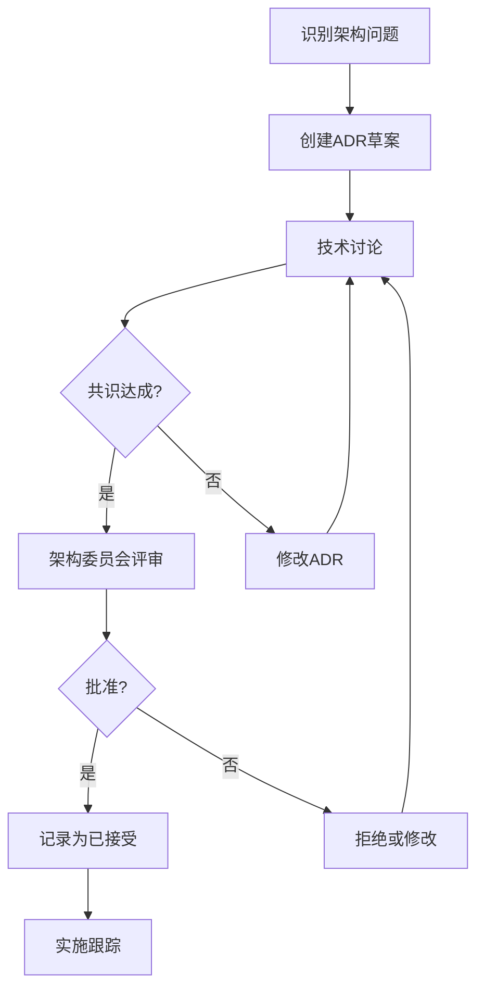

# 架构治理策略

## 概述
本文档定义了项目的架构治理策略，确保架构决策的权威性、一致性和可追溯性。

## 目标
1. **权威性**: 确保架构文档是唯一权威来源
2. **一致性**: 确保实现与架构文档一致
3. **可追溯性**: 所有架构决策都有记录和理由
4. **可执行性**: 有机制确保遵守架构规范

## 治理原则

### 1. 文档即权威
- 架构文档是技术实现的唯一权威来源
- 任何与文档不一致的实现都是技术债务
- 文档变更必须经过正式评审流程

### 2. 决策可追溯
- 所有架构决策必须记录在ADR中
- 决策必须有明确的理由和后果分析
- 决策状态必须清晰标识

### 3. 变更受控
- 架构变更必须经过正式评审
- 变更影响必须评估
- 向后兼容性必须考虑

### 4. 遵守可验证
- 实现必须能够验证是否符合架构
- 自动化检查必须集成到开发流程
- 违规必须有明确的处理流程

## 组织架构

### 架构委员会
**职责**:
- 评审和批准架构决策
- 制定架构标准和规范
- 监督架构实施情况
- 处理架构违规

**成员**:
- 首席架构师 (Chair)
- 技术负责人
- 各团队技术代表
- DevOps代表

**会议频率**: 每两周一次

### 技术负责人
**职责**:
- 确保团队遵守架构规范
- 提出架构改进建议
- 参与架构评审
- 培训团队成员

## 工作流程

### 1. 架构决策流程

### 2. 架构变更流程
1. **变更请求**: 提交架构变更申请
2. **影响分析**: 评估变更影响范围
3. **草案创建**: 创建新的ADR或更新现有ADR
4. **评审讨论**: 相关方讨论变更
5. **委员会批准**: 架构委员会批准变更
6. **实施计划**: 制定详细的实施计划
7. **执行跟踪**: 跟踪实施进度
8. **验证确认**: 验证变更效果

### 3. 违规处理流程
1. **检测**: 自动化检查或人工发现违规
2. **报告**: 创建违规报告
3. **评估**: 评估违规严重性和影响
4. **处理**:
   - **轻微违规**: 创建技术债务票，限期修复
   - **严重违规**: 暂停相关开发，立即修复
   - **架构冲突**: 提交架构委员会裁决
5. **修复**: 按照要求修复违规
6. **验证**: 验证修复效果

## 执行机制

### 自动化检查
**工具**: `scripts/architecture/check_document_consistency.py`

**集成点**:
1. **预提交钩子**: 阻止不符合架构的提交
2. **CI/CD流水线**: 在合并前检查架构一致性
3. **定期扫描**: 每周扫描全代码库

**检查范围**:
- ADR实施一致性
- 命名规范
- 接口规范
- 设计模式使用

### 手动检查
**代码审查**:
- 审查者必须检查架构一致性
- 使用架构检查清单
- 重点关注架构相关变更

**架构评审**:
- 定期架构评审会议
- 重点模块深度评审
- 技术债务评审

## 度量指标

### 架构健康度指标
| 指标 | 目标 | 测量频率 |
|------|------|----------|
| ADR覆盖率 | >90% | 每月 |
| 架构一致性 | >95% | 每周 |
| 技术债务率 | <10% | 每月 |
| 架构评审通过率 | >80% | 每季度 |

### 团队遵守指标
| 指标 | 目标 | 测量频率 |
|------|------|----------|
| 预提交检查通过率 | >95% | 每周 |
| 架构违规数量 | <5/月 | 每月 |
| 架构培训完成率 | 100% | 每季度 |

## 培训与沟通

### 新成员培训
1. **架构导览**: 项目架构概述
2. **ADR系统**: 如何使用ADR系统
3. **检查工具**: 如何使用架构检查工具
4. **治理流程**: 架构治理流程介绍

### 持续教育
1. **月度分享**: 架构最佳实践分享
2. **案例研究**: 成功/失败案例分析
3. **工具更新**: 新工具和流程培训

### 沟通渠道
1. **架构频道**: 技术讨论和问题解答
2. **公告板**: 架构变更和决策公告
3. **文档库**: 集中存储所有架构文档

## 例外处理

### 临时例外
**适用场景**:
- 紧急修复
- 实验性功能
- 第三方集成限制

**申请流程**:
1. 提交例外申请
2. 说明理由和期限
3. 架构委员会批准
4. 记录例外情况
5. 到期前必须解决或转为正式变更

### 永久例外
**适用场景**:
- 技术限制无法避免
- 业务需求冲突
- 成本效益分析不支持

**申请流程**:
1. 提交详细分析报告
2. 架构委员会深入评审
3. 记录为架构决策
4. 更新相关文档

## 审查与改进

### 季度审查
**审查内容**:
1. 架构决策有效性
2. 治理流程效率
3. 团队遵守情况
4. 工具和流程改进

**输出**:
1. 架构健康度报告
2. 改进行动计划
3. 政策更新建议

### 年度评估
**评估内容**:
1. 架构治理整体效果
2. 业务目标支持程度
3. 技术债务管理
4. 团队满意度

**输出**:
1. 年度架构报告
2. 下年度架构路线图
3. 治理策略调整

## 附录

### A. 架构检查清单
- [ ] 实现是否遵循相关ADR？
- [ ] 命名是否符合规范？
- [ ] 接口是否一致？
- [ ] 设计模式是否正确使用？
- [ ] 性能考虑是否充分？
- [ ] 安全性是否考虑？
- [ ] 可维护性是否良好？

### B. 违规严重性分级
- **P0 (严重)**: 导致系统不可用或数据丢失
- **P1 (高)**: 影响核心功能或性能
- **P2 (中)**: 影响非核心功能或可维护性
- **P3 (低)**: 代码风格或文档问题

### C. 相关文档
- [ADR模板](../architecture/decisions/ADR_TEMPLATE.md)
- [架构决策索引](../architecture/decisions/INDEX.md)
- [架构模式文档](../architecture-patterns.md)
- [代码审查指南](../../.github/CODE_REVIEW_GUIDELINES.md)

---

**版本**: 1.0  
**生效日期**: 2026-02-27  
**下次审查**: 2026-05-27  
**负责人**: 架构委员会